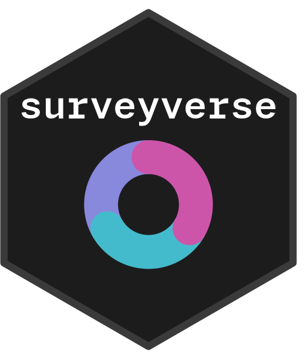

<!-- README.md is generated from README.Rmd. Please edit that file -->

```{r, include = FALSE}
knitr::opts_chunk$set(
  collapse = TRUE,
  comment = "#>",
  fig.path = "man/figures/README-",
  out.width = "100%"
)
```

# surveyverse 

<!-- badges: start -->
[](https://github.com/JDenn0514/surveyverse/actions/workflows/R-CMD-check.yaml)
[](https://app.codecov.io/gh/JDenn0514/surveyverse)
<!-- badges: end -->

The surveyverse is a collection of R packages for survey research, sharing a
common design philosophy, grammar, and data structures. Install all core
surveyverse packages with a single call to `library(surveyverse)`.

## Packages

| Package | Description |
|---------|-------------|
| [surveycore](https://github.com/JDenn0514/surveycore) | Core survey design objects, S7 classes, and metadata infrastructure |
| [surveytidy](https://github.com/JDenn0514/surveytidy) | dplyr/tidyr verbs (filter, select, mutate, etc.) for survey objects |
| [surveyweights](https://github.com/JDenn0514/surveyweights) | Advanced weighting, raking, and calibration methods |

## Installation

Install the development version from GitHub with:

```r
# install.packages("pak")
pak::pak("JDenn0514/surveyverse")
```

This will also install surveycore, surveytidy, and surveyweights from GitHub.
Once all packages are on CRAN, you will be able to install with:

```r
install.packages("surveyverse")
```

## Usage

```{r example, eval = FALSE}
library(surveyverse)
```

Loading surveyverse attaches all core packages and prints a summary of the
versions loaded.

## Learn more

See the [pkgdown site](https://jdenn0514.github.io/surveyverse/) for articles,
function reference, and package news.

## Code of Conduct

Please note that the surveyverse project is released with a
[Contributor Code of Conduct](https://jdenn0514.github.io/surveyverse/CODE_OF_CONDUCT.html).
By contributing to this project, you agree to abide by its terms.
